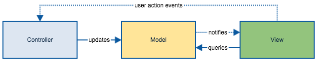

# Flux

[Reference](https://dotblogs.com.tw/blackie1019/2015/04/14/151049)

Flux 是由 Facebook 提出的一種 Design Pattern, 它不具有一個標準制式的框架, 而是一種設計的原則, 並已經有許多現存的實作模組, 可以簡化在系統中加入這樣架構的流程, 本範例使用的 Reflux 就是其中之ㄧ (但筆者目前查詢在 npm 上的排名已經不是最受歡迎的囉～, 想採用的可以再斟酌看看)。

### MVC 與遇到的問題
**簡單的 MVC 架構**

**複雜 MVC 可能出現的架構**

可以看到整個系統無限制的情況下, 會導致架構的發散與元件間互動關係的穿插複雜化, 最後導致於難以維護。

### Flux