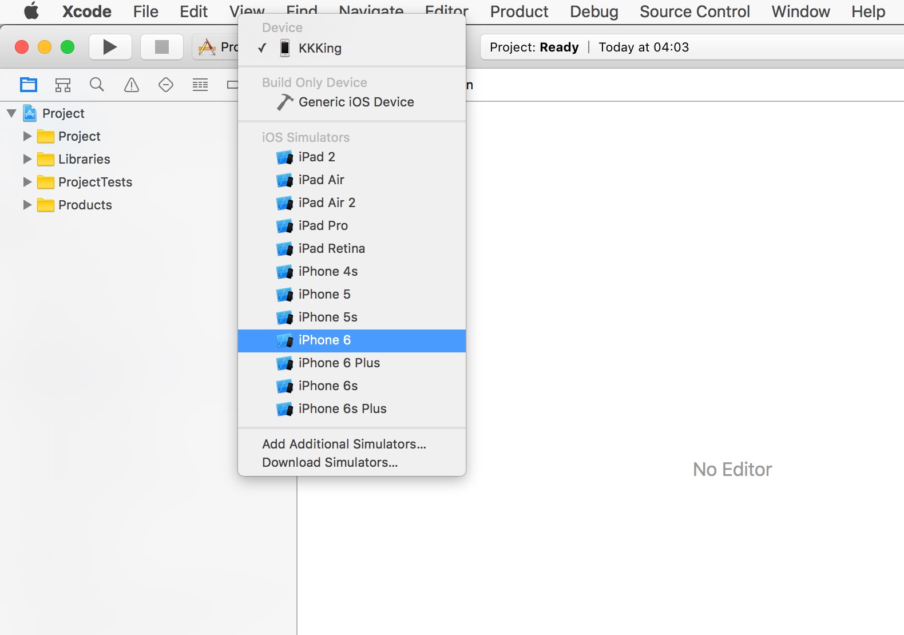
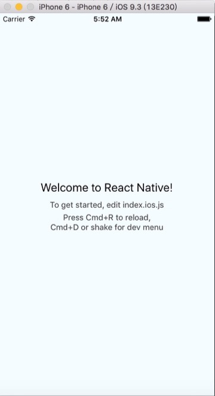
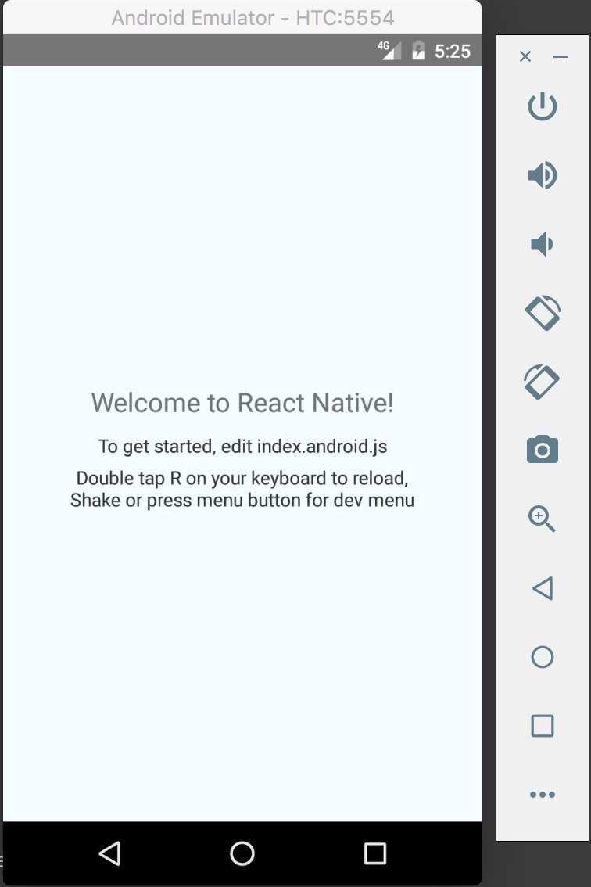
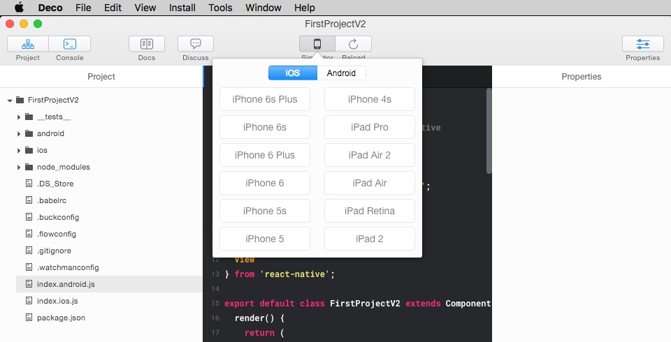

# Emulator (模擬器)
在將程式部署到手機前, 我們可以先透過模擬器先在電腦上驗證功能, 畢竟也不是每個人都有那麼多隻手機可以當作開發機, 再者部署到裝置的流程也較為複雜。

這邊一樣使用 `react-native init FirstProject` 創建的資料夾來示範, 結構如下

```
./
|-- android
|-- index.android.js
|-- index.ios.js
|-- ios
|-- node_modules
`-- package.json
```

### iOS
1. 先用 Shell 進入 project 的目錄底下執行 `npm start` (把 server 端跑起來)
> 如果你的環境變數有指定好 node.js 的路徑, 那第一步沒有執行也沒關係, 因為筆者預設的 Shell 跑起來是找不到 node.js (要額外透過 nvm 指定版本), 所以會自行另外先 run 起 server。
* 然後再用用 Xcode 開啟 ios 的目錄, 在左上角選擇完模擬的 Device 後按下左邊的 ▷ 按鈕, 這樣應該就能在模擬器中看到你的程式, 之後透過 ctrl + R 就可以 refresh 修改過的程式。





### Andorid
1. 先透過 Shell `android avd`, 將 AVD manager 啟動, 透過此介面將虛擬機器 start
2. 在 project 目錄底下執行 `react-native run-android`


***
### [Deco IDE](https://www.decosoftware.com/)
透過 Deco 的使用, 可以節省一些工作, 除了整合了模擬器的使用, 開啟 project 也較為快速、節省空間, 使用上不會太困難加上有許多輔助工具, 唯獨 Opensource 的開發中項目, 會有比較多不穩定的情況發生, 但應該假以時日就會好轉許多。
