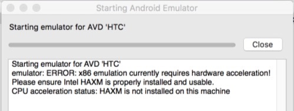

# Setup Environment
在開始寫第一支程式前, 我們還是需要先來做開發環境的設定, 這邊以 Mac 上的操作環境為主 (如果想要同時開發 Android、iOS 的應用程式的話, 我們只能選擇 Mac)。

### 先安裝 React-Native 使用到的函式庫
``` bash
brew install node
brew install watchman
brew install flow //Facebook 的 型別檢查函式庫
```

### 安裝 React-Native 的 command line tool
``` bash
npm install -g react-native-cli
```

***
### iOS
根據 Apple 官網文件安裝 XCode (IDE、iOS模擬器、iOS SDK), 相較於 Android 的開發環境, 是相當直覺的建立方式。

***
### Android
筆者原先是採用書中的做法來進行 android 的套件安裝, 但最後遇到如下圖所附的問題: **模擬器無法啟動**, 因為尚未安裝 HAXM (Hardware Accelerated Execution Manager)。


但是從 android sdk 的 tool manager 發現目前的版本 6.0.4 尚未提供讓 Mac 可以安裝。


從 [StackOverflow Q&A](http://stackoverflow.com/questions/39739984/intel-haxm-6-0-4-not-compatible-with-macos) 上面得知 work around 建議是安裝 6.0.3 的版本, 但是 StackOverflow 上的回覆也讓我心碎

> HAXM v6.0.3 can only be installed via Android Studio -> SDK manager.


所以最後只好回過頭, 透過直接安裝 Android Studio 的方式來解決這個環境的問題, AS 基本上一步一步按 繼續/同意 就可以安裝完畢。

再將環境變數的設定加入到 bashrc file 中, 讓 Shell 找得到開發工具。
```bash
# Android Develop
export ANDROID_HOME=~/Library/Android/sdk
export PATH=${PATH}:${ANDROID_HOME}/tools
```

之後再從 Android Studio 的 SDK manager 介面中去 launch android 原生的 sdk manager, 來安裝
**Intel x86 Atom System Image (for Android 7.1.1-API 25)**, 完成後安裝的動作就告一段落了。


之後透過 Command Line (Shel) 執行 `android avd` 創建一個模擬器 (Android Vritual Devices), 確保核選了 Use Host GPU (否則會執行得很慢), 這邊提供一個配置範例


***
#### 書中原作法供參考 （但 筆者本身不建議）
* 安裝 JDK (Java Development Kit)
* 安裝 Android SDK `brew install android-sdk`
* 在 shell 組態檔中 export ANDROID_HOME 變數指到 sdk 的安裝路徑 (ex. export ANDROID_HOME=/usr/local/opt/android-sdk)

** 透過 command line 執行 `android` 叫起 Android SDK Manager 的視窗介面, 除了預設項目要確保也安裝以下套件**

* Android SDK Build-tools version 25 //2016-10-20 最新版本
* Android 7.1.1 (API 25)
* Android Support Repository

** 重新啟動 Android SDK Manager 再安裝與模擬器相關的項目**

* Intel x86 Atom System Image (for Android 7.1.1-API 25)
* Intel x86 Emulator Accelerator (HAXM installer)

** 透過執行 `android avd` 創建一個模擬器 (Android Vritual Devices), 確保核選了 Use Host GPU (否則會執行得很慢)**

> 到此, 我們已經有了可以執行 Android、iOS 程式的環境, 剩下就是如何透過 React-Native 同時建構兩個版本的應用程式, 節省共用部分的開發時間。