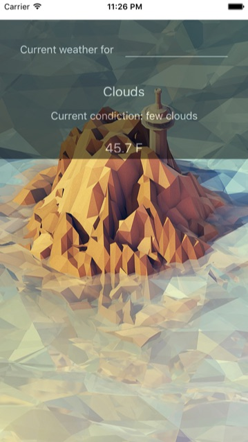

# 為應用程式添加背景圖片

## 靜態添加圖檔資源的方式
[官網連結](http://facebook.github.io/react-native/docs/images.html#content), 從 react-native 0.14 版開始, 加入靜態資源的方式 (內嵌入至應用程式中, 而非引用外部資源 ex. 網路上的圖片) 在 iOS 跟 Android 都可以透過相同的方式使用了

> 筆者因為參考書中的做法, 使用 image!filename 遇到了無法使用的問題, 建議還是參考使用官網建議的做法。

```
.
├── index.ios.js
└── img //可以將需使用的圖檔任意置放目錄內 (使用的時候是用相對位置指名路徑)
    ├── bg.png //可加上不同檔尾來區分解析度, 
                 //若加上filename.ios.png 或 android 的關鍵字
                 //packager 在打包資源的時候會分別依據平台打包
    ├── bg@2x.png
    └── bg@3x.png
```

使用方式
```javascript
<Image source={require('./img/bg.png')} />
```

### WeatherProject.js
```javascript
import React, {
  Component,
} from 'react';

import {
  StyleSheet,
  Text,
  View,
  TextInput,
  Image,
} from 'react-native';

import Forecast from './Forecast';

class WeatherProject extends Component {
  constructor(props) {
    super(props);
    this.state = {
      zip: '',
      forecast: {
        main: 'Clouds',
        description: 'few clouds',
        temp: 45.7
      }
    };
  }

  _handleTextChange(event) {
    console.log(event.nativeEvent.text);
    this.setState({
      zip: event.nativeEvent.text
    });
  }

  render() {
    return (
      <View style={styles.container}>
        <Image source={require('./img/BackGround.jpg')}
               resizeMode='cover'
               style={styles.backdrop}>
          <View style={styles.overlay}>
            <View style={styles.row}>
              <Text style={styles.mainText}>
                Current weather for
              </Text>
              <View style={styles.zipContainer}>
                <TextInput
                  style={[styles.zipCode, styles.mainText]}
                  returnKeyType='go'
                  onSubmitEditing={(event) => this._handleTextChange(event)}/>
              </View>
            </View>
            <Forecast
              main={this.state.forecast.main}
              description={this.state.forecast.description}
              temp={this.state.forecast.temp}/>
          </View>
        </Image>
       </View>
    );
  }
}

var baseFontSize = 16;

const styles = StyleSheet.create({
  container: {
    flex: 1,
    justifyContent: 'center',
    paddingTop: 30
  },
  backdrop: {
    flex: 1,
    width: null,
    height: null,
    flexDirection: 'column'
  },
  overlay: {
    paddingTop: 5,
    backgroundColor: '#000000',
    opacity: 0.5,
    flexDirection: 'column',
    alignItems: 'center'
  },
  row: {
    flex: 1,
    flexDirection: 'row',
    flexWrap: 'nowrap',
    alignItems: 'flex-start',
    padding: 30
  },
  zipContainer: {
    flex: 1,
    borderBottomColor: '#DDDDDD',
    borderWidth: 1,
    marginLeft: 5,
    marginTop: 3
  },
  zipCode: {
    width: 50,
    height: baseFontSize
  },
  mainText: {
    flex: 1,
    fontSize: baseFontSize,
    color: '#FFFFFF'
  }
});

export default WeatherProject;
```

### Result

