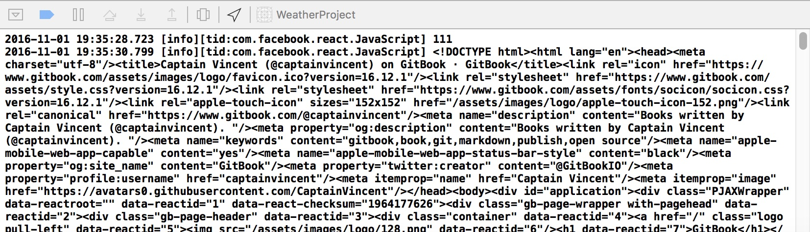

# Fetch API

### Simple Case
```javascript
  _handleTextChange(event) {
    console.log(event.nativeEvent.text);
    // 試著在原來的 handle 中增加了網路 fetch 的 API 去抓取網頁回來輸出到 console
    fetch('https://captainvincent.gitbooks.io/index.html')
      .then((response) => response.text())
      .then((responseText) => {
        console.log(responseText);
      });

    this.setState({
      zip: event.nativeEvent.text
    });
  }
```

### Result



> **React Native fetch() Network Request Failed.**
> 
> iOS 預設僅允許 https 的 request, 若是用 http 的網址則會回傳上面這個 error message, 或是要修改 info.plist (並rebuild project)
```xml
<key>NSAppTransportSecurity</key>
<dict>
    <key>NSAllowsArbitraryLoads</key>
    <true/>
</dict>
```

### Integration OpenWeatherMap API
這邊因為 OpenWeatherMap 的 API 已經改成需要註冊才能取得 APPKEY, 之後才能存取資料, 就先省略跳過進階的示範, 主要是將回傳的 JSON 資料導入 JSON  格式的容器中, 再取出設定而已。