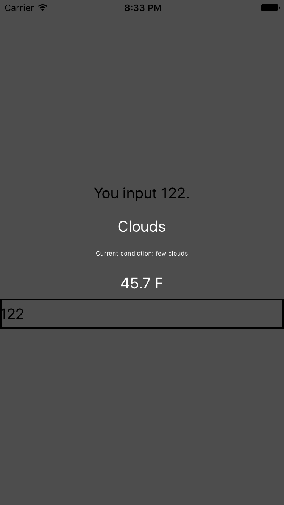

# Weather Project

接下來將實作一個 Demo 的程式來介紹進一步的細節, 首先 `react-native init WeatherProject` 創建一個新的 project, 再接著新增兩個 file 來做練習 (WeatherProject.js、Forecast)

```
./
|-- index.ios.js //React code
|-- WeatherProject.js //New file
|-- Forecast.js //New file
```

### index.ios.js
之所以將原先 init 建立的 Component (參考 FirstProject 建立的 index.ios.js 內容) 搬移出去到 WeatherProject.js 是因為想要共 code (iOS 與 Android 可以一同使用的部分希望可以整合到單一檔案)

```javascript
// 引用
import {
  AppRegistry,
} from 'react-native';
import WeatherProject from './WeatherProject';

// 註冊頂層元件給 AppDelegate.m
AppRegistry.registerComponent('WeatherProject', () => WeatherProject);
```

### Forecast.js
預報的元件, 用來呈現預報內容

```javascript
// 引用
import React, {
  Component,
} from 'react';

import {
  StyleSheet,
  Text,
  View,
} from 'react-native';

class Forecast extends Component {
  // 渲染內容
  render() {
    return(
      // 預報的三項資訊
      <View>
        <Text style={styles.bigText}>
          {this.props.main}
        </Text>
        <Text style={styles.mainText}>
          Current condiction: {this.props.description}
        </Text>
        <Text style={styles.bigText}>
          {this.props.temp} F
        </Text>
      </View>
    );
  }
}

const styles = StyleSheet.create({
  bigText: {
    flex: 2,
    fontSize: 20,
    textAlign: 'center',
    margin: 10,
    color: '#FFFFFF',
  },
  mainText: {
    flex: 1,
    fontSize: 8,
    textAlign: 'center',
    margin: 10,
    color: '#FFFFFF',
  },
});

export default Forecast;
```

### WeatherProject.js
```javascript
// 引用
import React, {
  Component,
} from 'react';
import {
  StyleSheet,
  Text,
  View,
  TextInput,
} from 'react-native';
import Forecast from './Forecast';

class WeatherProject extends Component {
  constructor(props) {
    // property
    super(props);
    this.state = {
      zip: '',
      forecast: {
        main: 'Clouds',
        description: 'few clouds',
        temp: 45.7
      }
    };
  }

  // Callback function, 用來處理輸入匡內文送出時的變化
  _handleTextChange(event) {
    console.log(event.nativeEvent.text);
    this.setState({
      zip: event.nativeEvent.text
    });
  }

  // 渲染內容
  // 將 Hardcode 寫死的 fake 資訊傳給 Forecast 元件
  // 宣告一個 Text Input 元件並將送出文字的行為串接 _handleTextChange
  render() {
    return (
      <View style={styles.container}>
        <Text style={styles.welcome}>
          You input {this.state.zip}.
        </Text>
        <Forecast
          main = {this.state.forecast.main}
          description = {this.state.forecast.description}
          temp = {this.state.forecast.temp}/>
        <TextInput
              style={styles.input}
              returnKeyType='go'
              onSubmitEditing={(event) => this._handleTextChange(event)}/>
      </View>
    );
  }
}

// Text style 設定
const styles = StyleSheet.create({
  container: {
    flex: 1,
    justifyContent: 'center',
    alignItems: 'center',
    backgroundColor: '#4D4D4D',
  },
  welcome: {
    fontSize: 20,
    textAlign: 'center',
    margin: 10,
  },
  input: {
    fontSize: 20,
    borderWidth: 2,
    height: 40,
    }
});

export default WeatherProject;
```

### Result
