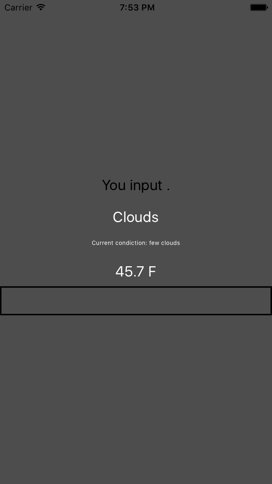

# Weather Project

接下來將實作一個 Demo 的程式來介紹進一步的細節, 首先 `react-native init WeatherProject` 創建一個新的 project, 再接著新增兩個 file 來做練習 (WeatherProject.js、Forecast)

```
./
|-- index.ios.js //React code
|-- index.android.js //React code
|-- WeatherProject.js //New file
|-- Forecast.js //New file
```

### Result
