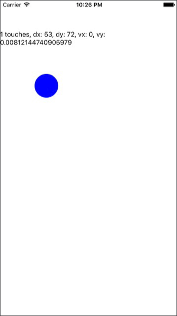

# 觸控元件

***
### TouchableHighlight
任何回應使用者觸控事件的介面元素都應該被 TouchableHighlight 標籤包裝著, 該元件會與以下事件建立掛鉤, 開發者再將其行為定義即可。

* onPressIn
* onPressOut
* onLongPress

**Github: bonniee/learning-react-native/Touch/PressDemo.js**
```javascript
import React, { Component } from 'react';
import {
  StyleSheet,
  Text,
  View,
  TouchableHighlight
} from 'react-native';

class Button extends Component {
  constructor(props) {
    super(props);
    this.state = { pressing: false };
  }

  _onPressIn = () => {
    this.setState({pressing: true});
  }

  _onPressOut = () => {
   this.setState({pressing: false}); 
  }

  render() {
    return (
      <View style={styles.container}>
        <TouchableHighlight
          onPressIn={this._onPressIn}
          onPressOut={this._onPressOut}
          style={styles.touchable}>

          <View style={styles.button}>
            <Text style={styles.welcome}>
              {this.state.pressing ? 'EEK!' : 'PUSH ME'}
            </Text>
          </View>

        </TouchableHighlight>
      </View>
      );
  }
}

const styles = StyleSheet.create({
  container: {
    flex: 1,
    justifyContent: 'center',
    alignItems: 'center',
    backgroundColor: '#F5FCFF',
  },
  welcome: {
    fontSize: 20,
    textAlign: 'center',
    margin: 10,
    color: '#FFFFFF'
  },
  touchable: {
    borderRadius: 100
  },
  button: {
    backgroundColor: '#FF0000',
    borderRadius: 100,
    height: 200,
    width: 200,
    justifyContent: 'center'
  },
});

export default Button;
```

***
### GestureResponder 系統
除了 "觸碰" 以外的行為定義, React Native 也提供的兩種可自訂的觸控處理: GestureResponder (較低階的行為描述)、PanResponder。

預設由最上層 (最深的節點元件) 的 view 來處理觸控事件; 要能處理觸控事件的 View 應該實作其四種屬性 

* View.props.onStartShouldSetResponder //回傳 true 時該 view 會嘗試成為回應程序
* View.props.onMoveShouldSetResponder //回傳 true 時該 view 會嘗試成為回應程序
* View.props.onResponderGrant //當無其他更深節點時會被授權成為回應程序, 此函式被呼叫
* View.props.onResponderReject //當有其他更適合的角色則被拒絕


若父節點想要強制攔截程序時, 可透過 onStartShouldSetResponderCapture、onMoveShouldSetResponderCapture 的回傳值得到 true 進而阻止子節點成為回應程序。

#### 回應程序角色
當該 View 順利成為觸控回應程序後, 就能收到並觸發以下相關的處理程序。

* View.props.onResponderMove //使用者移動手指
* View.props.onResponderRelease //觸碰結束時觸發
* View.props.onResponderTerminationRequest //有其他元件想要成為處理程序時, 此 view 是否應該釋出回應程序? 回傳true 會釋出
* View.props.onResponderTerminate //回應程序被搶走後, 可能透過上面函式 或是 OS 在沒詢問下取走 (控制、通知中心)

收到觸控事件的內容格式

* changeTouches //從上一次事件後所有改變的 **觸控事件之陣列**
* identifier //觸碰的 ID
* locationX //觸碰相對於元素的 X 座標
* locationY //觸碰相對於元素的 Y 座標
* pageX //觸碰相對於螢幕的 X 座標
* pageY //觸碰相對於螢幕的 X 座標
* target //接收觸控事件元素的節點 id
* timestamp //觸碰的時間戳記, 計算向量時很有用
* touches //目前螢幕上所有觸碰的陣列

***
### PanResponder
將 GestureResponder 系統包裝成高階的 API (gestureState) 存取以下的資訊

* startID //gestureState 的 ID (只要螢幕上至少一個觸碰)
* moveX //最近一次碰觸移動的螢幕座標
* moveY //最近一次碰觸移動的螢幕座標
* x0 //回應程序產生時的螢幕座標
* y0 //回應程序產生時的螢幕座標
* dx //從觸碰開始累計的手勢移動距離
* dy //從觸碰開始累計的手勢移動距離
* vx //目前手勢的向量
* vy //目前手勢的向量
* numberActiveTouches //目前螢幕上的觸碰數量

#### 使用方式

建構 PanResponder 需傳入一些 callback function
```javascript
this._panResponder = PanResponder.create({
  onStartShouldSetPanResponder: this._handleStartShouldSetPanResponder,
  onMoveShouldSetPanResponder: this._handleMoveShouldSetPanResponder,
  onPanResponderGrant: this._handlePanResponderGrant,
  onPanResponderMove: this._handlePanResponderMove,
  onPanResponderRelease: this._handlePanResponderEnd,
  onPanRespondeTerminate: this._handlePanRespondeEnd,
});
```

再透過展開語法將 PanResponder 加入 render 中的 View
```javascript
render: function(){
  return(
    <View>
      {...this._panResponder.panHandlers}>
      ( /*View的內容*/ )
    </View>
  );
}
```

### index.ios.js / index.android.js

同 WeatherProject, 這層僅是一個轉介層。
```javascript
import React from 'react';
import {
  AppRegistry,
} from 'react-native';

import PanDemo from './PanDemo';

AppRegistry.registerComponent('PanDemo', () => PanDemo);
```

### PanDemo.js

```javascript
// Adapted from https://github.com/facebook/react-native/blob/master/Examples/UIExplorer/PanResponderExample.js

'use strict';

import React, { Component } from 'react';
import {
  StyleSheet,
  PanResponder,
  View,
  Text
} from 'react-native';

const CIRCLE_SIZE = 50;
const CIRCLE_COLOR = 'blue';
const CIRCLE_HIGHLIGHT_COLOR = 'green';

class PanDemo extends Component {

  // Set some initial values.
  _panResponder = {}
  _previousLeft = 0
  _previousTop = 0
  _circleStyles = {}
  circle = null

  constructor(props) {
    super(props);
    this.state = {
      numberActiveTouches: 0,
      moveX: 0,
      moveY: 0,
      x0: 0,
      y0: 0,
      dx: 0,
      dy: 0,
      vx: 0,
      vy: 0
    };
  }

  componentWillMount() {
    this._panResponder = PanResponder.create({
      onStartShouldSetPanResponder: this._handleStartShouldSetPanResponder,
      onMoveShouldSetPanResponder: this._handleMoveShouldSetPanResponder,
      onPanResponderGrant: this._handlePanResponderGrant,
      onPanResponderMove: this._handlePanResponderMove,
      onPanResponderRelease: this._handlePanResponderEnd,
      onPanResponderTerminate: this._handlePanResponderEnd,
    });
    this._previousLeft = 20;
    this._previousTop = 84;
    this._circleStyles = {
      style: {
        left: this._previousLeft,
        top: this._previousTop,
      }
    };
  }

  componentDidMount() {
    this._updatePosition();
  }

  render() {
    return (
      <View style={styles.container}>
        <View
          ref={(circle) => {
            this.circle = circle;
          }}
          style={styles.circle}
          {...this._panResponder.panHandlers}/>
        <Text>
          {this.state.numberActiveTouches} touches,
          dx: {this.state.dx},
          dy: {this.state.dy},
          vx: {this.state.vx},
          vy: {this.state.vy}
        </Text>
      </View>
    );
  }

  // _highlight and _unHighlight get called by PanResponder methods,
  // providing visual feedback to the user.
  _highlight = () => {
    this.circle && this.circle.setNativeProps({
      style: {
        backgroundColor: CIRCLE_HIGHLIGHT_COLOR
      }
    });
  }

  _unHighlight = () => {
    this.circle && this.circle.setNativeProps({
      style: {
        backgroundColor: CIRCLE_COLOR
      }
    });
  }

  // We're controlling the circle's position directly with setNativeProps.
  _updatePosition = () => {
    this.circle && this.circle.setNativeProps(this._circleStyles);
  }

  _handleStartShouldSetPanResponder = (e: Object, gestureState: Object) => {
    // Should we become active when the user presses down on the circle?
    return true;
  }

  _handleMoveShouldSetPanResponder = (e: Object, gestureState: Object) => {
    // Should we become active when the user moves a touch over the circle?
    return true;
  }

  _handlePanResponderGrant = (e: Object, gestureState: Object) => {
    this._highlight();
  }

  _handlePanResponderMove = (e: Object, gestureState: Object) => {
    this.setState({
      stateID: gestureState.stateID,
      moveX: gestureState.moveX,
      moveY: gestureState.moveY,
      x0: gestureState.x0,
      y0: gestureState.y0,
      dx: gestureState.dx,
      dy: gestureState.dy,
      vx: gestureState.vx,
      vy: gestureState.vy,
      numberActiveTouches: gestureState.numberActiveTouches
    });

    // Calculate current position using deltas
    this._circleStyles.style.left = this._previousLeft + gestureState.dx;
    this._circleStyles.style.top = this._previousTop + gestureState.dy;
    this._updatePosition();
  }

  _handlePanResponderEnd = (e: Object, gestureState: Object) => {
    this._unHighlight();
    this._previousLeft += gestureState.dx;
    this._previousTop += gestureState.dy;
  }
}

const styles = StyleSheet.create({
  circle: {
    width: CIRCLE_SIZE,
    height: CIRCLE_SIZE,
    borderRadius: CIRCLE_SIZE / 2,
    backgroundColor: CIRCLE_COLOR,
    position: 'absolute',
    left: 0,
    top: 0,
  },
  container: {
    flex: 1,
    paddingTop: 64,
  },
});

export default PanDemo;
```

### Result

點壓藍色圓則會轉變成綠色, 並根據使用者的操作更新上方顯示的文字內容。
