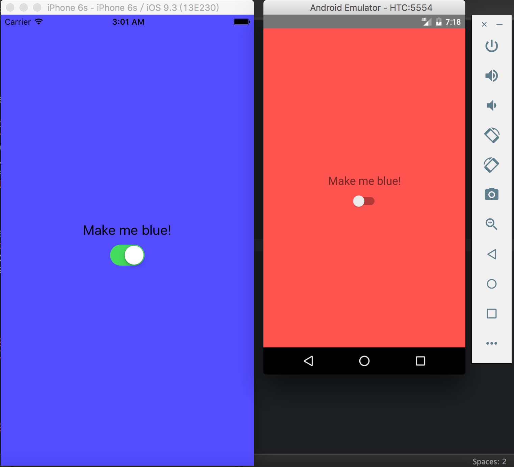

# 平台專屬的元件
雖說 React Native 的目的在於打造跨平台一次性的寫作, 但我們仍舊能夠在這些程式中使用到平台專屬的元件, 混合這兩者一起使用。

```
./
|-- index.ios.js //React code
|-- index.android.js //React code
|-- crossplatform.js //New file
|-- switch.ios.js //New file
|-- switch.android.js //New file
```

### index.ios.js / index.android.js
轉介層
```javascript
import React from 'react';
import {
  AppRegistry,
} from 'react-native';

import CrossPlatform from './crossplatform';

AppRegistry.registerComponent('CrossPlatform', () => CrossPlatform);
```

### switch.ios.js
```javascript
import React, {
  Component,
} from 'react';

import {
  SwitchIOS,
} from 'react-native';

class Switch extends Component {
  constructor(props) {
    super(props);
    this._onValueChange = this._onValueChange.bind(this);
    this.state = {
      value: false,
    };
  }

  _onValueChange(value) {
    this.setState({value: value});
    if(this.props.onValueChange){
      this.props.onValueChange(value);
    }
  }

  render() {
    return (
      <SwitchIOS
        onValueChange = {this._onValueChange}
        value = {this.state.value}/>
    );
  }
}

export default Switch;
```
>switch.android.js 的差別在於 **SwitchIOS** 元件用 **SwitchAndroid** 取代。

### crossplatform.js
```javascript
import React, {
  Component,
} from 'react';

import {
  StyleSheet,
  Text,
  View,
} from 'react-native';

import Switch from './switch';

class CrossPlatform extends Component {
  constructor(props) {
    super(props);
    this._onValueChange = this._onValueChange.bind(this);
    this.state = {
      val: false,
    };
  }

  _onValueChange(val) {
    this.setState({val: val});
  }

  render() {
    var colorClass = this.state.val ? styles.blueContainer : styles.redContainer;
    return (
      <View style={[styles.container, colorClass]}>
        <Text style={styles.welcome}>
          Make me blue!
        </Text>
        <Switch onValueChange={this._onValueChange}/>
      </View>
    );
  }
}

var styles = StyleSheet.create({
  container: {
    flex: 1,
    justifyContent: 'center',
    alignItems: 'center',
  },
  blueContainer: {
    backgroundColor: '#5555FF'
  },
  redContainer: {
    backgroundColor: '#FF5555'
  },
  welcome: {
    fontSize: 20,
    textAlign: 'center',
    margin: 10,
  }
});

export default CrossPlatform;
```

### Result
