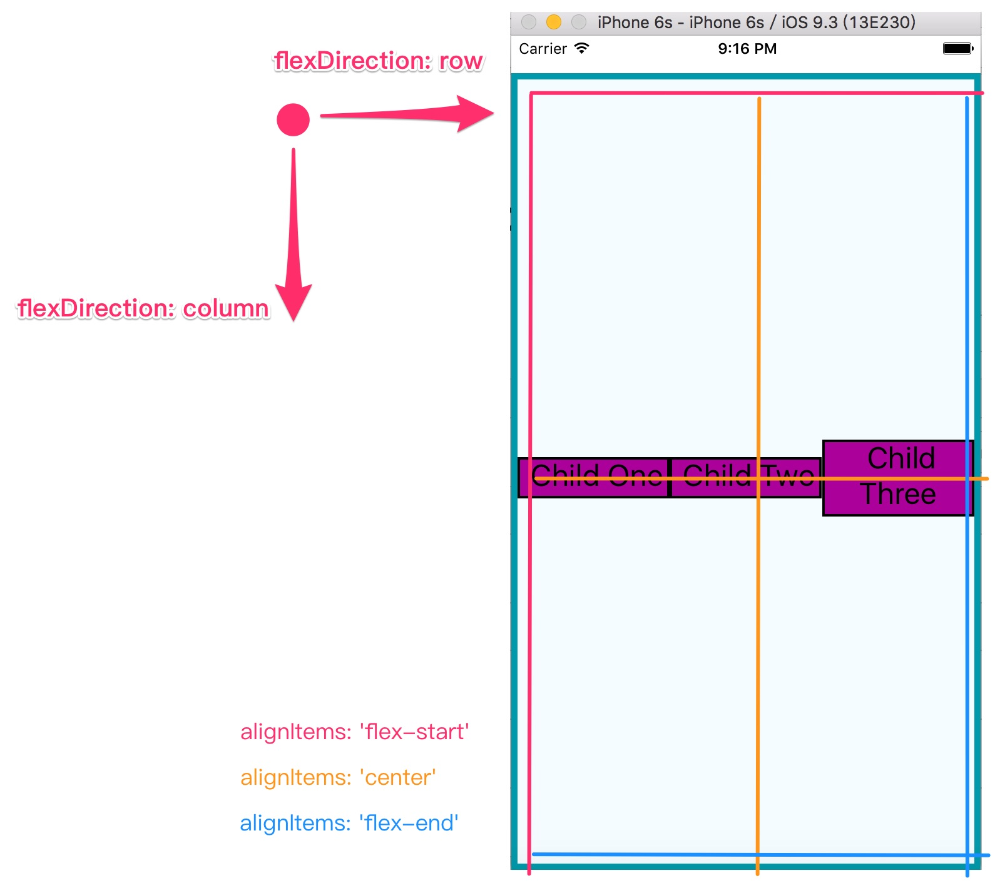

# 樣式設定
一個完整的應用, 除了功能另一個重點就是外觀, 外觀要如何刻畫是本章的學習重點。

如果想要在 React Native 與 網頁應用程式間共用相同的樣式, GitHub 上有專案提供了 React Native 的網頁樣式系統
(https://github.com/js-next/react-style

> 傳統的 CSS 具有 Global 的特性, 當引用函式庫時, 會難以維護同時引入的全域變數 (樣式), React Native 只實作了 CSS 的一個子集。


## 樣式物件
以下介紹的寫法都是樣式物件的衍伸。

#### 行內樣式
```html
<Text>
  The quick <Text style={{fontStyle: "italic"}}>brown</Text> fox jumped over the lazy <Text style={{fontWeight: "bold"}}>dog</Text>.
</Text>
```
> \{\{fontStyle: "italic"\}\} 其實為一個物件, 將它傳遞給 style 屬性。

#### 樣式物件
```html
var italic = {
  fontStyle: "italic"
};

var bold = {
  fontWeight: "bold"
}

<Text>
  The quick <Text style={italic}>brown</Text> fox jumped over the lazy <Text style={bold}>dog</Text>.
</Text>
```

#### 使用 Stylesheet.Create
可以參考之前出現過數次的範例程式, 主要的功用是將樣式物件封裝成內部物件, 確保其 **不可以變** 與 **不透明** 的特性。

#### 樣式合併
可以 **傳入物件陣列** 以及 **使用行內樣式** (陣列中愈右邊優先權愈高)
```html
<TEXT style={[styles.type1, styles.type2, {color: '#FFFFFF'}]}>
  context.
</TEXT>
```

#### 條件樣式
可以使用條件樣式, 讓元件狀態改變時 (這邊例子是當觸碰到時) 使用額外樣式
```html
<View style={[style.button, this.state.touching && styles.highlight]}/>
```

#### 透過屬性接收樣式物件
```javascript
class Sample extends Component {
  propTypes: {
    style: Text.propTypes.Style
  },
  
  getDefaultProps(){
    return{
      style: {}
    };
  },

  render() {
    return (
      <Text style={[myStyles.text, this.props.style]}>
        Hello, World.
      </Text>
    );
  }
}
```

## 管理樣式
常見的做法是為元件建立單一目錄, 包含了 **元件** 與 **該元件使用的樣式**

```
Component Name
./
|-- index.js
|-- styles.js
```

如同 TEXT/IMG 章節提到的, React Native 中偏好使用重複的 **樣式元件**, 而非重複的使用 **樣式**, 但凡事還是有例外, 當如果需要共用樣式時建議專案的結構如下。

```
./
|-- Component
|   |-- Button
|       |-- index.js
|        `-- styles.js
|
|-- styles
|   |-- styles.js
|   |-- colors.js
|   |-- fonts.js
```
> 共同樣式可以引入 ex. 調色盤、字型、標準邊寬 ...etc。

## Layout (flexbox)
Flexbox 屬性
* flex //代表元件佔相同層級中的份量 (比例)
* flexDirection
* flexWrap
* alignSelf
* alignItems

### index.ios.js
```javascript
/**
 * Sample React Native App
 * https://github.com/facebook/react-native
 * @flow
 */

import React, { Component } from 'react';
import {
  AppRegistry,
  StyleSheet,
  Text,
  View
} from 'react-native';

class Project extends Component {
  render() {
    return (
      <View style={styles.parent}>
        <Text style={styles.child}> Child One </Text>
        <Text style={styles.child}> Child Two </Text>
        <Text style={styles.child}> Child Three </Text>
      </View>
    );
  }
}

const styles = StyleSheet.create({
  parent: {
    flex: 1,
    flexDirection: 'row',
    alignItems: 'center',
    backgroundColor: '#F5FCFF',
    borderColor: '#0099AA',
    borderWidth: 5,
    marginTop: 30,
  },
  child: {
    flex: 1,
    backgroundColor: '#AA0099',
    borderWidth: 2,
    textAlign: 'center',
    fontSize: 24,
  },
});

AppRegistry.registerComponent('Project', () => Project);
```

### Result

