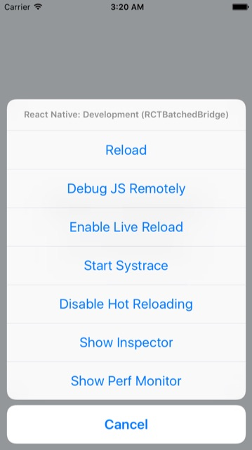
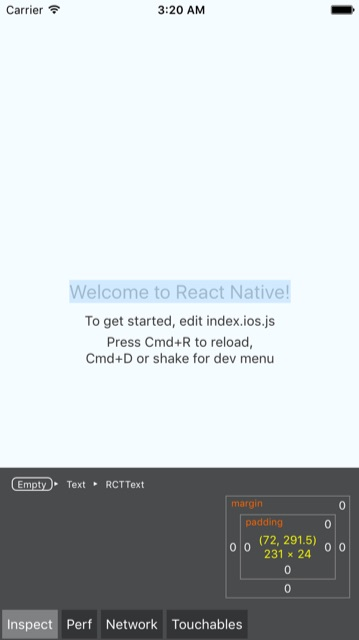

# Debug
介紹一些常用的除錯方式。

### Console.log
最簡單的方式是使用 console.log 輸出 debug message, 可以在 Xcode 與 Android Studio 中看見 log, 更方便的做法是 Shell 在 project 底下執行 (可以直接輸出 log 資訊在 terminal 中)

```bash
$ react-native log-ios
$ react-native log-android
```

### Device develop tool
* iOS use **Command ⌘ + D**
* Android use **Command ⌘ + M** 

Launch **Show Inspector**



Select Instance 可以看到渲染的資訊



### Remote debug
根據 Facebook 官方的資料, 以前是能透過 Google 的 Develop Tool 開啟 plugin **React Develop Tool**, 不過目前功能已經被閹掉了 (默哀)。

>It is currently **not possible** to use the "React" tab in the Chrome Developer Tools to inspect app widgets. You can use Nuclide's "React Native Inspector" as a workaround.

至於用 Safari 連結 iphone 的部分, 使用模擬器測試看不到 UI 元件的 view, 僅 console log 正常, 所以這部分就先暫擱, 稍後當功課再補完。

[Weinre Reference](http://people.apache.org/~pmuellr/weinre/docs/latest/)

### Red Screen of Death
一般常見語法錯誤都會造成紅色畫面, 畫面上會呈現的 Debug Message, 通常都是滿有用的資訊。

### Flow
Flow 是靜態型別檢驗的工具, 可以用來提早檢驗問題的發生。

* 可以在 .flowconfig 內先添加 `.*/node_modules/.*`, 避開檢查 node_module 的程式 (第三方模組安裝路徑)

* 然後執行 `flow check --ignore-version` (--ignore-version 是因為檢查工具版本的資訊 跟 設定檔內有時會不 match, 繞過這個問題所下的參數)

> 因為忽略了第三方模組安裝的路徑, 所以檢查時會報出一些必要 module 沒找到的問題。

### Jest
基於 [Jasmine](https://github.com/jasmine/jasmine) 建構的單元測試框架


### 一些常見問題
* No visible interface for RCTRootView, 通常表示 React Native 中的 Object-C 類別因為某些因素導致於 Xcode 中無法看到 => 檢查套件, 重新執行 npm install
* React Native 的套件管理員會在執行程式時自動啟動 (新開一個 Shell), 若是沒有關閉即切換專案, 會使之停留於前一個專案目錄下, 可以透過 `npm start` 手動決定何時啟用。
* 部署至 iOS 上出現問題, 首先可以至 [iTunes Connect]() 檢查開發者帳號的權限, 接受尚未同意的協議。